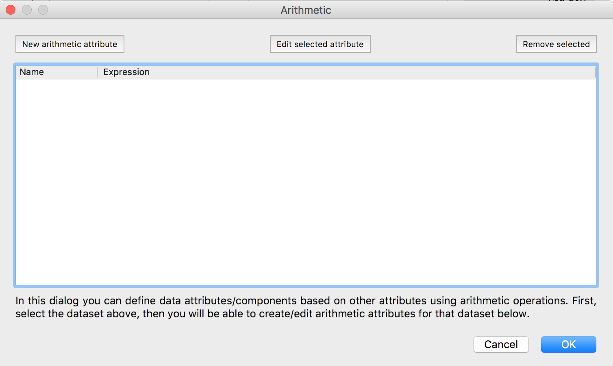
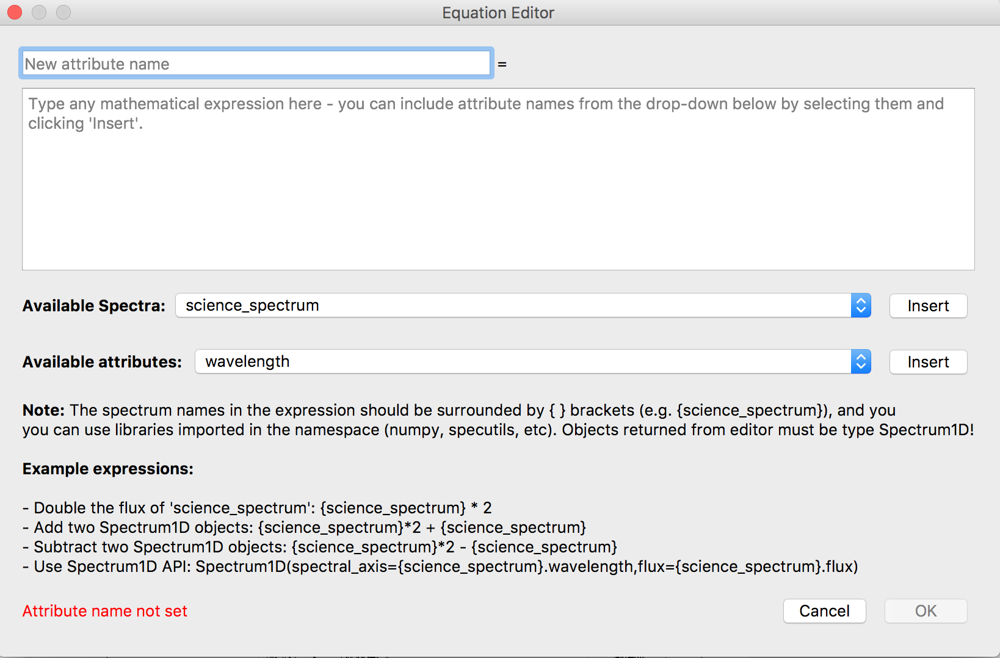
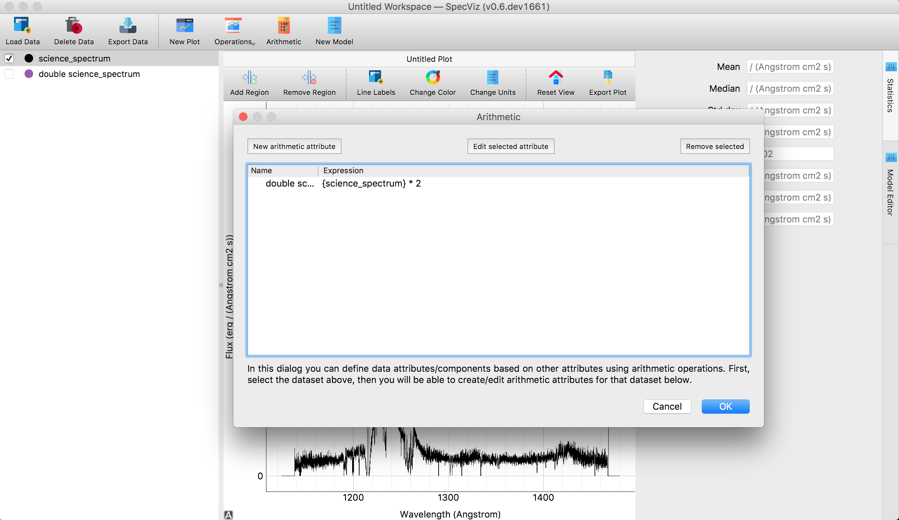
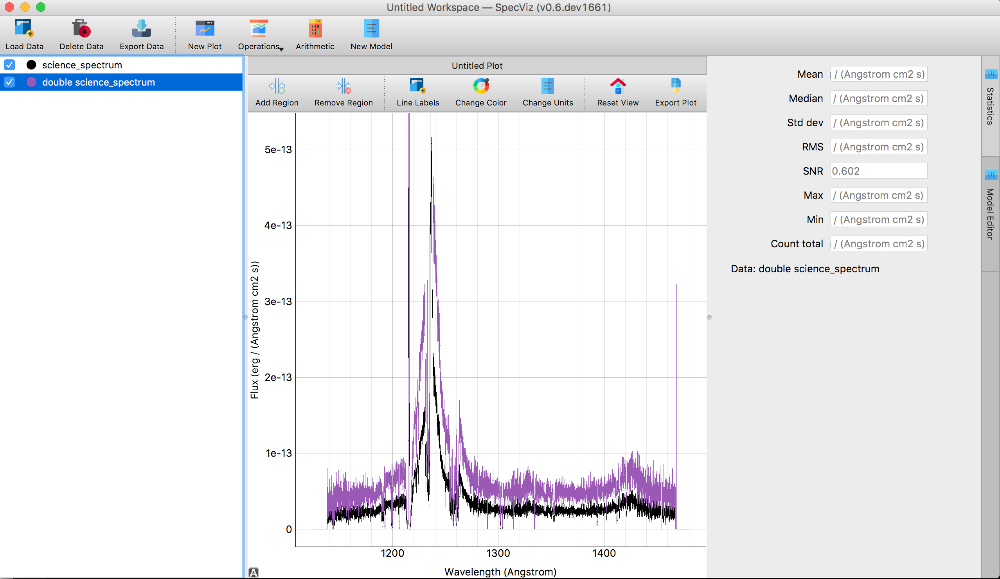

.. _specviz-arithmetic:

Arithmetic Widget
=================
The Arithmetic widget allows users to perform basic arithmetic on their spectra
that are loaded into Specviz. The arithmetic editor accepts data loaded into the
Specviz session and only outputs type `specutils.Spectrum1D <https://specutils.readthedocs.io/en/latest/api/specutils.Spectrum1D.html>`_. 
This means the editor allows users to perform the same arithmatic operations that are available with 
`specutils.Spectrum1D` objects.

Launching Arithmetic Editor
---------------------------

Lets start by loading the arithmetic layer widget located on the tool bar.
Upon clicking you will be prompted with the arithmetic dialog

From this dialog you can add, edit or remove arithmetic items from the
editor. We will start by clicking the New Arithmetic Attribute button located in 
top left hand corner of the Editor dialog. Upon clicking you will be prompted with
the editor dialog

Adding Arithmetic
-----------------

Once the Arithmetic widget is launched, spectra and their components can be added
here by typing the names directly surrounded by '{}' or by selecting the spectrum
in the dropdown bar and clicking insert. We are going to take the preloaded spectrum 
(``science_spectrum``) and create a new spectrum that is double the flux of ``science_spectrum``
and call it ``double science_spectrum``.

.. image:: _static/valid_expression.png

To validate arithmetic, click the OK button located at the bottom right hand corner of the
dialog box. 

.. warning::
    If the python syntax is invalid, the editor will not allow you to continue! The editor
    can only return `SpecUtils Spectrum1D <https://specutils.readthedocs.io/en/latest/api/specutils.Spectrum1D.html>`_
    objects.

Now, there will be a new data item located in the data collection called ``double science_spectrum``.

To show the result in the plotting window, select the data item by clicking the box next ``double science_spectrum``.

This is a very simple example of the arithmetic you can perform with the SpecViz arithmetic editor. There are more example
expressions located at the bottom of the ``equation editor`` dialog.