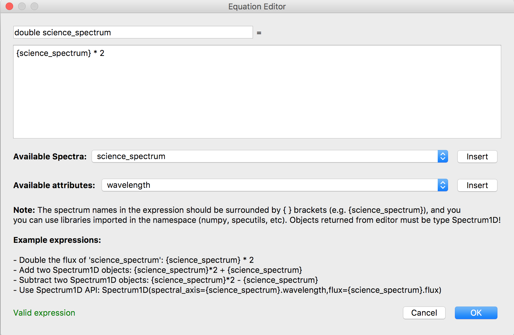

.. _specviz-arithmetic:

.. DANGER:: 

      Please note that this version of Specviz is **no longer being actively supported
      or maintained**. The functionality of Specviz is now available and being actively
      developed as part of `Jdaviz <https://github.com/spacetelescope/jdaviz>`_.

Arithmetic Editor
=================

The Arithmetic Editor allows users to perform basic spectral arithmetic.
Inputs are spectra loaded into the Specviz session.
Outputs are also spectra in SpecViz.

To load the Arithmetic Editor, click on the Arithmetic button in the
:ref:`workspace toolbar <specviz-workspace-toolbar>`. This dialog box will appear:

.. image:: _static/arithmetic-layer.png

From this dialog you can add, edit or remove arithmetic items from the
editor.

.. note::

    All spectra are specutils.Spectrum1D objects in astropy.
    Therefore, the Arithmetic Editor allows users to perform the
    arithmatic operations that are incorporated into the specutils.Spectrum1D object.

Example
^^^^^^^

We will walk you through an example of how to multiply a spectrum by a factor of 2.
Start by clicking the "New Arithmetic Attribute" button in the top left and the
following dialog box will appear:

.. image:: _static/equation_editor.png

Arithmetic is done using expressions entered into the large box. Examples of operations
are given at the bottom of the dialog box. We first assign a name to the output data by
entering it in the first text box; we will call the output of this example ``double science_spectrum``.
Let's choose a spectrum to operate on called "science spectrum" by choosing it from the
first drop-down menu and clicking "Insert." Let's choose to operate on the wavelength axis
by choosing "wavelength" from the second drop-down menu and clicking "Insert." Click on the
text editor to start editing and multiply the inserted component by ``2``:

To validate arithmetic, click the OK button located at the bottom right hand corner of the
dialog box. 

.. warning::
    If the python syntax is invalid, the editor will not allow you to continue! The editor
    can only return `SpecUtils Spectrum1D <https://specutils.readthedocs.io/en/latest/api/specutils.Spectrum1D.html>`_
    objects.

Now, there will be a new data item located in the data collection called ``double science_spectrum``.

.. image:: _static/new_expression.png

To show the result in the plotting window, select the data item by clicking the box next ``double science_spectrum``.

.. image:: _static/plotted_expression.png

This is a very simple example of the arithmetic you can perform with the SpecViz arithmetic editor. There are more example
expressions located at the bottom of the ``equation editor`` dialog.