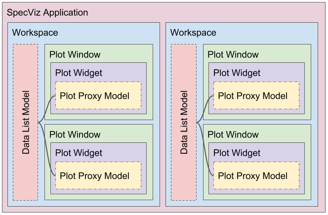
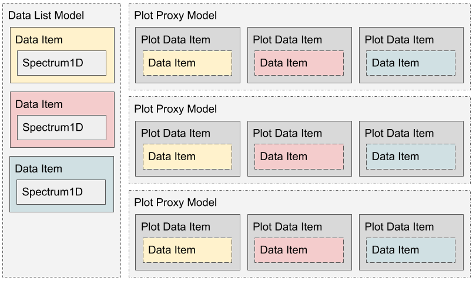

.. DANGER:: 

      Please note that this version of Specviz is **no longer being actively supported
      or maintained**. The functionality of Specviz is now available and being actively
      developed as part of `Jdaviz <https://github.com/spacetelescope/jdaviz>`_.

.. |DataListModel| replace:: :class:`~specviz.core.models.DataListModel`
.. |DataItem| replace:: :class:`~specviz.core.items.DataItem`
.. |PlotDataItem| replace:: :class:`~specviz.core.items.PlotDataItem`
.. |PlotProxyModel| replace:: :class:`~specviz.core.models.PlotProxyModel`
.. |Workspace| replace:: :class:`~specviz.widgets.workspace.Workspace`
.. |PlotWindow| replace:: :class:`~specviz.widgets.plotting.PlotWindow`
.. |PlotWidget| replace:: :class:`~specviz.widgets.plotting.PlotWidget`
.. |Hub| replace:: :class:`~specviz.core.hub.Hub`

Developer Documentation
=======================

This set of documentation focuses on the structure of SpecViz, its various
pieces, and how they work together. Below is a simplified reference diagram
from some of the core aspects of the SpecViz architecture.

Data Model
----------

All spectral data are stored internally as :class:`specutils.Spectrum1D`, but
these are exposed in SpecViz through |DataItem| objects. These objects are
Qt-aware and can interact with the GUI in ways that a simple :class:`specutils.Spectrum1D`
container cannot. However, individual |DataItem| objects are immutable in
most cases, and only a single list of |DataItem| objects are ever maintained
in the SpecViz application instance. Instead, |PlotDataItem| objects are used
which internally reference a single |DataItem|. Multiple |PlotDataItem| objects
can reference the same |DataItem|, this reduces duplication of data on the user's
disk. Likewise, |PlotDataItem| objects have many mutable aspects that can be
defined on a per-object basis and do not affect the state of the underlying
|DataItem|.

The central piece of SpecViz is the internal Qt data model expressed in the
|DataListModel| class. It is responsible for maintaining the collection of
:class:`~specutils.Spectrum1D` objects and exposing them as Qt |DataItem| objects.

In the context of SpecViz, the :class:`~specutils.Spectrum1D` is considered
immutable. In a similar sense, |DataItem| is only a Qt interface to an
*instance* of the :class:`~specutils.Spectrum1D` class. As such, it is possible
to change which :class:`~specutils.Spectrum1D` the |DataItem| contains, but
otherwise exposes no other means to change the spectrum in-place.

While SpecViz contains Qt view widgets that expose |DataListModel| objects (e.g.
``QListView``), this is generally not done directly. Instead, a proxy model
(|PlotProxyModel|) is used to wrap and expose the |DataItem| items as
|PlotDataItem| objects. These are fundamentally different from the |DataItem| objects in that
they contain mutable attributes that determine how the |DataItem| they contain
will be expressed in SpecViz. This ranges from whether or not the item is
hidden, what its current plot color is, what its currently user-defined name
is, etc. They are also workspace-specific, and not plot window-specific like
the |PlotProxyModel| and |PlotDataItem| objects.

Application and Workspaces
--------------------------

The ``specviz.app.Application`` is the singular Qt application instance
run to begin interacting with SpecViz. It is within this class that |Workspace|
instances are generated and maintained. It contains methods for adding,
removing, and retrieving workspaces to the application instance. This class is
also responsible for parsing and loading any plugins that exist in the
``plugins`` directory as well as adding them to the plugin registry maintained
by an instance of the :class:`~specviz.core.plugin.Plugin` class.

Within a single SpecViz application, multiple, independent |Workspace| objects can be
created. Each workspace its own internal |DataListModel| and therefore
maintains a completely separate set of data items. Workspaces themselves
contain all the interactive elements a user will see, including the main tool
bar, the data items list, plugins, and any number of |PlotWindow| instances.
The display of the data items is handled by the |PlotProxyModel|, and this
|PlotProxyModel| is particular to a single |PlotWindow|. It itself shows all
data items that exist in the |DataListModel|. Opening multiple
|PlotWindow| objects will result in as many |PlotProxyModel| objects. This is helpful for
performance reasons because data in the |Workspace| instance is never
duplicated; these is a single control of data items, and the |PlotProxyModel|
simply handles the display of the data items as |PlotDataItem| objects.

As mentioned, each |Workspace| can contain multiple |PlotWindow| objects, and the set
of these |PlotWindow| objects is handled by the |Workspace| objects' ``QMdiArea`` widget. The
|Workspace| is also responsible for adding
(:func:`~specviz.widgets.workspace.Workspace.add_plot_window`), removing
(:func:`~specviz.widgets.workspace.Workspace.remove_current_window`), and
providing access to the current
(:func:`~specviz.widgets.workspace.Workspace.current_plot_window`), or entire
list of, |PlotWindow| objects. Workspaces also act as the source for events raised by
interacting with both |PlotWindow| items as well as |PlotDataItem| objects in the list
view widget.

+------------------------------+--------------------------------------------------------------------------+
| ``window_activated``         | Fired when a single Workspace becomes current.                           |
+------------------------------+--------------------------------------------------------------------------+
| ``window_closed``            | Fired when a Workspace is closed.                                        |
+------------------------------+--------------------------------------------------------------------------+
| ``current_item_changed``     | Proxy signal indicating that an item in the list view has changed.       |
+------------------------------+--------------------------------------------------------------------------+
| ``current_selected_changed`` | Fired when the selected item in the list view has changed.               |
+------------------------------+--------------------------------------------------------------------------+
| ``plot_window_added``        | Fired when a new PlotWindow is added to the Workspace's QMdiArea widget. |
+------------------------------+--------------------------------------------------------------------------+
| ``plot_window_activated``    | Fired when a PlotWindow becomes active.                                  |
+------------------------------+--------------------------------------------------------------------------+

|Workspace| objects also contain the methods for providing the Qt dialogs for
loading data (:func:`~specviz.widgets.workspace.Workspace.load_data_from_file`)
using the ``specutils`` IO infrastructure, as well as exporting data
(:meth:`~specviz.widgets.workspace.Workspace._on_export_data`), and deleting
data items (:meth:`~specviz.widgets.workspace.Workspace._on_delete_data`).

Plot Windows and Plot Widget
----------------------------

|PlotWindow| objects are implemented as subclasses of ``QMdiSubWindow`` Qt objects. On
creation, these sub window objects are added to the |Workspace| object's ``QMdiArea``
and exposed as tabs in the plot window area. Each |PlotWindow| contains the
set of tools used to interact with the plot directly. This mostly includes
things like changing line colors (which will be reflected in colored icon next
to the data item in the data item list).

|PlotWindow| objects are instantiated by their parent |Workspace|, and are passed a
reference to the |Workspace| object's |DataListModel|. It is the responsibility of the
|PlotWindow| (and, more specifically, the |PlotWindow| object's |PlotWidget|) to
create the corresponding |PlotProxyModel| used for that particular |PlotWindow|
instance. In essence, the |PlotWindow| is really a container for housing the
plot tool bar and the |PlotWidget|, and generally only contains functionality
that doesn't directly involve manipulating the |PlotWidget| directly.

The |PlotWidget| is the plotted representation of all the |PlotDataItem| objects in
its internal |PlotProxyModel|. The widget itself is a subclass of ``PyQtGraph`` object's
|PlotWidget| object. Anything that affects the visual representation of the
loaded data is done in this class. For instance, operations like changing the
displayed units of the plot are handled here, in which case, the |PlotWidget|
updates its local |PlotDataItem| with the new unit information, triggering the
|PlotWidget| to re-render.

|PlotWidget| also handles operations like adding/removing ROIs to/from a plot,
as well as reporting region selection information for the currently active ROI.
In addition, it also contains the methods for adding
(:func:`~specviz.widgets.plotting.PlotWidget.add_plot`) and removing
(:func:`~specviz.widgets.plotting.PlotWidget.remove_plot`) |PlotDataItem| objects, and
responding to changes in their visibility state. The |PlotWidget| has several
events that other widgets may listen to

+------------------+-------------------------------------------------------------+
| ``plot_added``   | Fired when a |PlotDataItem| has been added to the plot.     |
+------------------+-------------------------------------------------------------+
| ``plot_removed`` | Fired when a |PlotDataItem| has been removed from the plot. |
+------------------+-------------------------------------------------------------+
| ``roi_moved``    | Fired when an ROI has been moved on the plot.               |
+------------------+-------------------------------------------------------------+
| ``roi_removed``  | Fired when an ROI has been removed from the plot.           |
+------------------+-------------------------------------------------------------+

Plot Proxy Model and Plot Data Items
------------------------------------

The |PlotProxyModel| is a simple wrapper that can be used to expose
|PlotDataItem| objects for use in |PlotWindow| objects. When a |PlotWindow| is created and
activated, the parent |Workspace| receives a signal and sets the model
displayed in the data list view to the |PlotWindow| object's |PlotProxyModel|. The
|PlotProxyModel| itself is given the source |DataListModel| model and maintains
a dictionary mapping the UUID of each |DataItem| to the
|PlotProxyModel|-specific |PlotDataItem|. By overriding the ``data`` and
``setData`` methods of the parent ``QSortFilterProxyModel``, the |PlotProxyModel|
is able to access information from both the |PlotDataItem| (e.g. color
information, visibility information, etc) as well as from the |DataItem| (e.g.
its name) for use in displaying the information in data view widgets.

|PlotDataItem| objects themselves are subclasses of ``PyQtGraph`` object's |PlotDataItem| class
which handles the display of data as Qt ``GraphicsItem`` objects. The |PlotDataItem|
class contains extra information about the *current* unit definitions and
characteristics like color, line width, and visibility of the plot data. As an
example, when a user changes the units displayed for a plot, all plotted
|PlotDataItem| objects have their units converted to the displayed values.
|PlotDataItem| objects are also responsible for maintaining the
:class:`pyqtgraph.ErrorBarItem` for the display of uncertainties that exist
on the |DataItem|.

Likewise, changes to the |PlotDataItem| raise events that other widgets and
objects may listen to

+--------------------------------------+------------------------------------------------------------------------------+
| ``data_unit_changed``                | Fired when the data units of the |PlotDataItem| have changed.                |
+--------------------------------------+------------------------------------------------------------------------------+
| ``objectspectral_axis_unit_changed`` | Fired when the spectral axis units of the |PlotDataItem| have changed.       |
+--------------------------------------+------------------------------------------------------------------------------+
| ``color_changed``                    | Fired when the color of the |PlotDataItem| has changed.                      |
+--------------------------------------+------------------------------------------------------------------------------+
| ``width_changed``                    | Fired when the width of the plotted line for the |PlotDataItem| has changed. |
+--------------------------------------+------------------------------------------------------------------------------+
| ``visibility_changed``               | Fired when the visibility of the |PlotDataItem| has changed.                 |
+--------------------------------------+------------------------------------------------------------------------------+

Centralized Hub and Plugins
---------------------------

The |Hub| class acts as a centralized API source
for external functionality (e.g. plugins) to easily interact with the core
SpecViz infrastructure. It is mostly an abstraction over various, perhaps
obscured portions of the internal data model and plotting representations.

The most useful case for the |Hub| is within plugins. The design of the plugin
infrastructure is such that, when adding a class to the plugin registry, that
class is injected with a reference to the |Hub| and has access to all the
abstracted API.

SpecViz plugins are specified by the ``plugin``
decorator. When a SpecViz application instance is loaded, the decorator will
add the plugin to the plugin registry and initialize the class to be added to
the application instance. Storing the plugin in the registry allows the
class definition to persist through the duration of the application lifetime
which is especially useful in the case of opening e.g. multiple |Workspace| objects,
each of which must then re-initialize any imported plugins from the registry.

There are three types of plugins for SpecViz:

    1. plugin bar plugins: these are added to the right side of SpecViz and are
       encapsulated in a ``QTabWidget`` that allows the user to select the plugin
       of interest and have its widget contents displayed in on the side.
    2. tool bar plugins: these plugins are added to the top main tool bar of
       SpecViz and generally contain UI composes as pop-up dialogs or as basic
       functions.
    3. plot bar plugins: these are added to the tool bar within a |PlotWindow|
       instance and generally interact with the plot itself.

In the future, the ability to hot-reload or load plugins on demand may be
implemented. Likewise, UI elements that display a list of loaded plugins as
well as the ability to disable plugins from being loaded is being considered.
