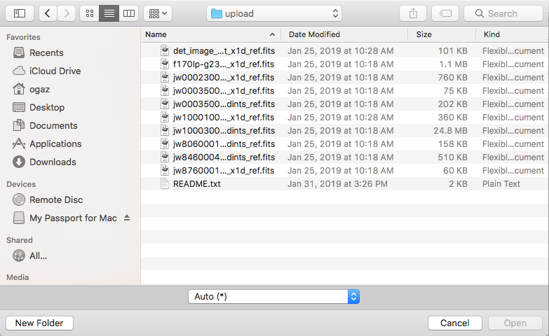
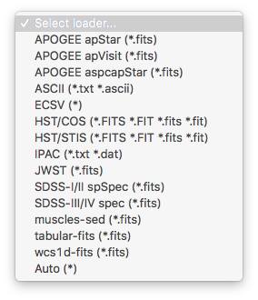
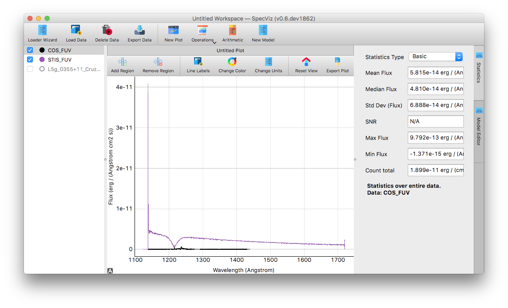

.. _specviz-start:

Getting Started
===============

Loading a Basic Spectrum
------------------------

Lets start by loading a simple, known spectrum. If you followed the steps in
:ref:`specviz-launching`, you should see the specviz window up, but without a
spectrum.

There are two options to load a spectrum data file:

1. Load the spectrum with a pre-defined data loader, or a custom user-defined data loader.
2. Utilize the :doc:`Loader Wizard </loader_wizard>` to create a new custom loader, and use that to load your data.

Either way, the specific loader for your data can be selected from the drop
down list in the open file dialog

Once the file has been loaded, you will be greeted with a plotted spectrum.

Exporting Spectra
-----------------

A user can export a given spectrum in the data list by highlighting the
spectrum and clicking the ``Export Data`` button in the main toolbar. This
will provide the user with a save file dialog where they may choose where to
save the exported spectrum file.

.. note::

    `ECSV <http://docs.astropy.org/en/stable/api/astropy.io.ascii.Ecsv.html>`_
    is currently the only supported export format. This will change in the
    future as more exporting formats are supported in the specutils package.

Workspaces and Plots
--------------------

Loaded data is added to the global data list for the entire workspace. A
workspace is an instance of the SpecViz application. Several can be
open at once and more can be added by selecting ``File > New Workspace`` from
the menu bar. Workspaces are completely independent of one another, and the
user can have as many workspaces are they wish.

Plots are the visual representation of a selection of data items within a
particular workspace. A user can have as many plots as they wish, and new plots
can be created by clicking the ``New Plot`` button in the main toolbar.
Likewise, plot windows can be removed by clicking the ``X`` button in the plot
tab.

Plots all share the same data list within a workspace. The caveat is that plots
can only show data that have equivalent units. Any data that cannot be added
to a plot will show as disabled in the data list.

Clicking the checkbox next to an item in the data list will plot the data
item on the current plot.

Using Regions
-------------

Interesting regions can be defined by adding an ROI to the plot. This is done
via the ``Add Region`` button in the plot toolbar. Multiple regions can be
used when defining e.g. areas the user might wish to use for model fitting.

A blue highlighted region is considered the _active_ region, and will in cases
where it is imported (e.g. statistics), will be used to define the region
used in the calculations.

.. note::

    Currently, only one region can be the "selected" region. This will change
    in the future to allow a subset of plotted region to be defined as
    "selected".

Removing a region is accomplished by clicking the ``Remove Region`` button.
Only the currently selected region is removed.

