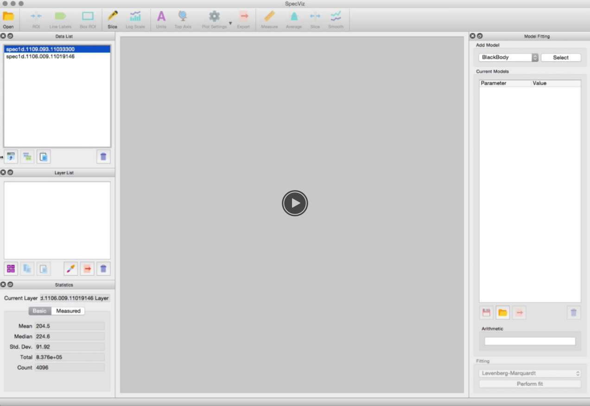

.. SpecViz documentation master file, created by
   sphinx-quickstart on Mon Feb  8 02:58:02 2016.
   You can adapt this file completely to your liking, but it should at least
   contain the root `toctree` directive.

SpecViz: 1D Spectral Visualization Tool
=======================================

SpecViz is a tool for visualization and quick-look analysis of 1D astronomical
spectra. It is written in the Python programming language, and therefore can be
run anywhere Python is supported (see :ref:`doc_installation`). SpecViz is
capable of reading data from FITS and ASCII tables (see :ref:`doc_custom_loaders`).

SpecViz allows spectra to be easily plotted and examined. It supports
instrument-specific data quality handling, flexible spectral units conversions,
custom plotting attributes, plot annotations, tiled plots, and other features.

SpecViz notably includes a measurement tool for spectral lines which
enables the user, with a few mouse actions, to perform and record measurements.
It has a model fitting capability that enables the user to create simple
(e.g., single Gaussian) or multi-component models (e.g., multiple Gaussians for
emission and absorption lines in addition to regions of flat continuua).
SpecViz incorporates various methods for fitting such models to data. For more
details, see :ref:`doc_model_fitting`.

Furthermore, SpecViz allows for overplotting or combining of spectra.

SpecViz will soon include the ability to
   - Measure the average of multiple spectra, detrending, and apply Fourier filters.
   - Interactively renormalize data from spectral templates.
   - Overplot spectral line lists.
   - And more...

Demo
----

Installation and Setup
----------------------

.. toctree::
   :maxdepth: 2

   installation
   launching

Using SpecViz
-------------

.. toctree::
   :maxdepth: 2

   viewer
   model_fitting
   line_labels
   custom_loaders

References/API
--------------

.. toctree::
   :maxdepth: 1

   api

Indices and tables
==================

* :ref:`genindex`
* :ref:`modindex`