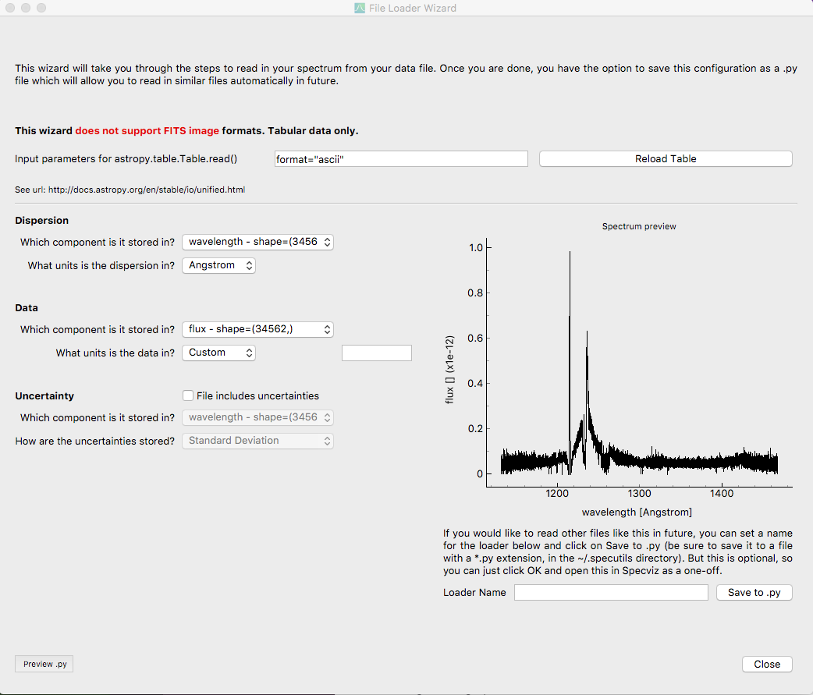

.. _doc_loader_wizard:

Loader Wizard
-------------

The loader wizard will assist users in generating a custom data loader. After
working through the wizard a new loader python file can be saved to a
directory of the user's choice (default is the ``~/.specutils`` directory). The
written loader will then be automatically added to the specutils loader
registry and accessible from the file open dialog.

The top field of the wizard requires additional parameters that may be needed
by `astropy.table.Table.read` to open the data file.  The syntax of this field
should match the syntax following the filename parameter in an
`astropy.table.Table.read` call. For example, the grayed
out text in the above figure shows an additional parameter of
``format="ascii"``.  For multiple additional parameters you should include
commas, i.e. ``format = "ascii", comment = "*"``. See the `astropy.table.Table`
documentation for the available options. Once this field is filled out, you can
press the Refresh Data button and the wizard will reload the table from the
provided file. If the `~astropy.table.Table.read` command was
successful, the remaining sections of the wizard will be populated.

The bottom left field for the Loader Name determines the label assigned to the
saved loader. When the ``Save to .py`` button is clicked, it will open a new
dialog for saving the loader file on your machine.  The loader label name and
the filename can be different.

You will not be able to save your new loader without valid units defined for
the data section and the dispersion section. You can see a preview of the
generated loader wizard by clicking on the ``Preview .py`` button.

The wizard is only able to handle table data, and will not properly handle FITS
image data.  Additionally, although not currently
implemented, we plan on supporting bit masks in a future release.