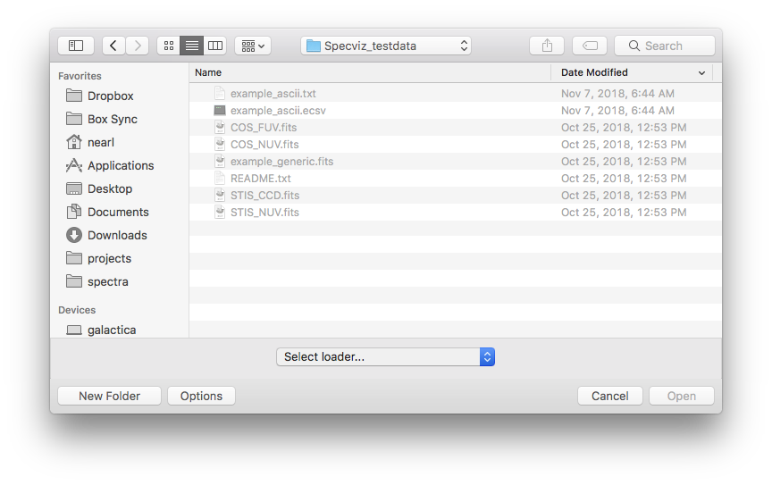
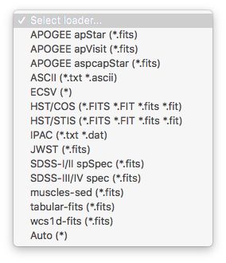
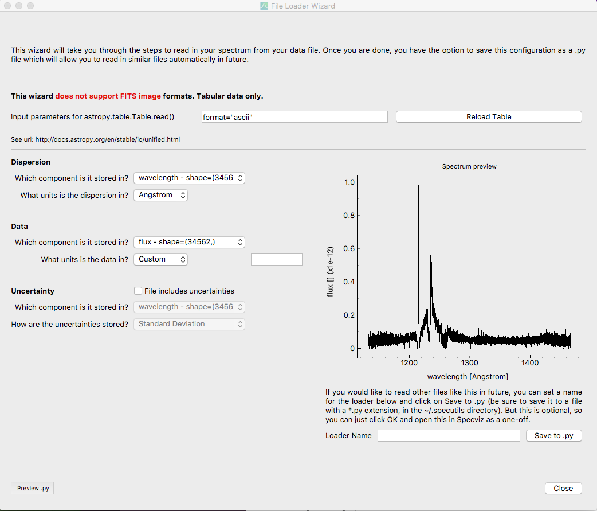

.. _specviz_loading_data:

.. DANGER:: 

      Please note that this version of Specviz is **no longer being actively supported
      or maintained**. The functionality of Specviz is now available and being actively
      developed as part of `Jdaviz <https://github.com/spacetelescope/jdaviz>`_.

Loading Data
============

SpecViz provides various ways to load spectral data, including a GUI and command line
interface. It supports many ASCII and FITS Binary Table file types. FITS Image
files are not currently supported, but there are plans to add this capability
in the future.

.. _specviz-loader-list:

Supported File Types
--------------------
Although a variety of file types can be used through :ref:`custom`,
SpecViz leverages several built in loaders provided by SpecUtils. The
table below defines the built in loaders and what file characteristics they
expect.

=====================  =======================  =================================================
Loader Name            Extension                Additional Specification
=====================  =======================  =================================================
APOGEE apStar          ``.fits``                filename starts with ``apStar``
APOGEE apVisit         ``.fits``                filename starts with ``apVisit``
APOGEE aspcapStar      ``.fits``                filename starts with ``aspcapStar``
ASCII                  ``.txt`` or ``.ascii``
ECSV                   ``.ecsv``
HST/COS                ``.fits``                header values ``TELESCOP`` = ``HST`` and  ``INSTRUME`` = ``COS``
HST/STIS               ``.fits``                header values ``TELESCOP`` = ``HST`` and  ``INSTRUME`` = ``STIS``
IPAC                   ``.txt`` or ``.dat``
JWST                   ``.fits``                hdulist includes an ``ASDF`` extensions, at least one HDU named ``EXTRACT1D``
SDSS-I/II spSpec       ``.fits``                filename matches spSpec-NNNNN-NNNN-NNN.fits, where N is an integer
SDSS-III/IV spec       ``.fits``                filename matches spSpec-NNNN(N)-NNNNN-NNNN.fits, where N is an integer
muscles-sed            ``.fits``                filename ends with ``sed.fits``, hdulist has BinTable in the first extension, header keyword ``PROPOSID`` = 13650
tabular-fits           ``.fits``                hdulist has BinTable in first extension.
wcs1d-fits             ``.fits``                header keyword ``NAXIS`` = ``1``, ``CTYPE1`` in primary header
=====================  =======================  =================================================

Loading Basic Spectra
---------------------
To see instructions on loading data through the command line, see the
:ref:`specviz-launching` section.

To load spectra once inside the SpecViz API you can click on the
``Load Data`` button in the workspace toolbar. This will open a file dialog
window.  At the bottom of this window is a drop down list of built in loaders.
If ``Auto*`` is chosen, SpecViz will attempt to open the file with the loaders
whose identifier specification match the file.

Once the file has been loaded, the spectrum plot should appear.

Loader Wizard
-------------

The Loader Wizard assists with loading spectra into SpecViz. For a given
spectrum it creates a custom loader file which can then be used to load the
spectrum (and spectra in the same format) without having to use the wizard,
accessed from the ``Load Data`` file dialog window.

The Loader Wizard is invoked by clicking on the ``Loader Wizard`` button in
the workspace toolbar. The below dialog box will display:

The Loader Wizard uses `astropy.table.Table.read` to open the data file. Desired
input parameters for `astropy.table.Table.read` can be entered in the top text
box of the Loader Wizard. The syntax of this field should match the syntax
following the filename parameter in an `astropy.table.Table.read` call. For
example, the grayed out text in the above figure shows an additional parameter
of ``format="ascii"``.  For multiple additional parameters you should include
commas, i.e. ``format = "ascii", comment = "*"``. See the `astropy.table.Table`
documentation for the available options. Once this field is filled out, you can
press the Refresh Data button and the wizard will reload the table from the
provided file. If the `~astropy.table.Table.read` command was
successful, the drop downs in the Dispersion, Data and Uncertainty sections of
the wizard will be populated.

The bottom left field for the Loader Name determines the label assigned to the
saved loader. When the ``Save to .py`` button is clicked, it will open a new
dialog for saving the loader file on your machine.  The loader label name and
the filename can be different.

You will not be able to save your new loader without valid units defined for
the data section and the dispersion section. You can see a preview of the
generated loader wizard by clicking on the ``Preview .py`` button.

The Loader Wizard is able to handle table data (including FITS binary tables),
but cannot currently handle FITS image data. Additionally, although not currently
implemented, we plan on supporting bit masks in a future release.

.. _custom:

Custom Loader Creation
----------------------

For data/file types with no built in loader and not supported in the File Loader
Wizard, a custom loader may be necessary. Instructions
on how to build a Custom Loader can be found in
`the Specutils documentation <https://specutils.readthedocs.io/en/latest/custom_loading.html>`_.
If the finished Python loader file is saved to ``~/.specutils/`` it will be
accesible through the Specviz interface.
