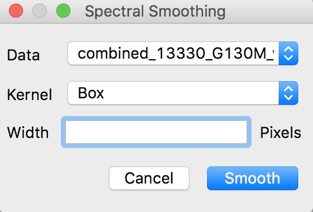

.. _specviz_operations:

Operations
==========
Operations are modules that preform calculations on a given spectrum.
To preform an operation, first select a spectrum from the
:ref:`data list <specviz-data-list>`. Then click on the "Operations"
button in the :ref:`workspace toolbar <specviz-workspace-toolbar>`.
A drop down will appear listing all the available operations.

Smoothing
---------
First select smoothing from the operations menu. The following
smoothing dialog will open:

Select the desired data, kernel type and width. When ready click ``Smooth``.
The newly smoothed data will appear as an item in the :ref:`data list <specviz-data-list>`.
The naming convention for the outputs of smoothed data is as follows::

    <Original Name> Smoothed(<Kernel Type>, <Kernel Size>)

The output data will be in the same units as the input data.
