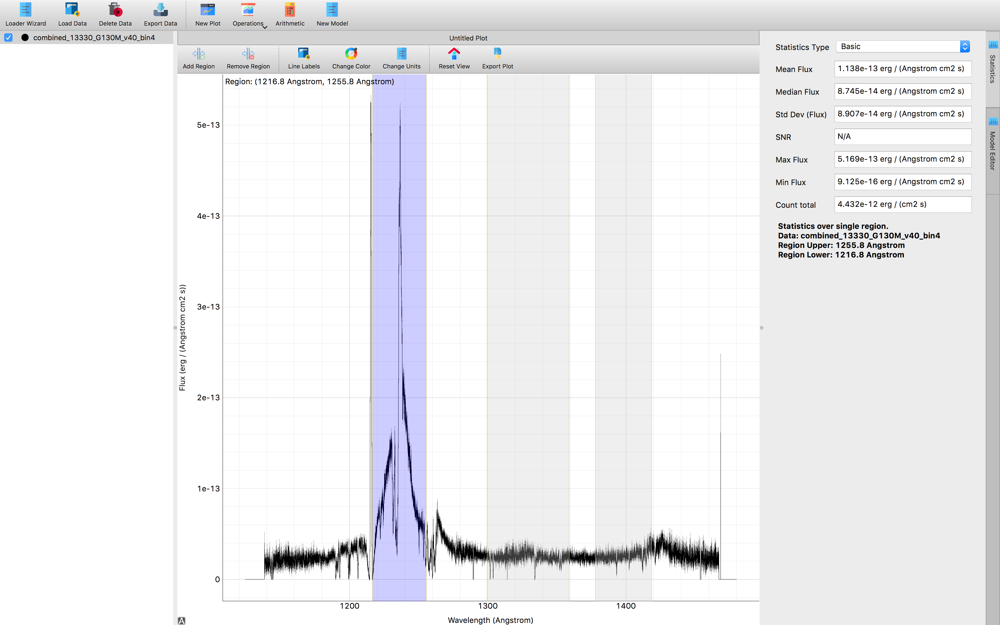

.. _specviz-regions:

.. DANGER:: 

      Please note that this version of Specviz is **no longer being actively supported
      or maintained**. The functionality of Specviz is now available and being actively
      developed as part of `Jdaviz <https://github.com/spacetelescope/jdaviz>`_.

Regions of Interest (ROI)
=========================

A user may select single or multiple wavelength ranges of spectra for model
fitting or measuring statistics. This is done with the "Region of Interest"
(or, ROI) selector via the Add Region button in the plot toolbar.  When a
region is selected, it is highlighted with a blue shading.  This region will
be used for the statistics panel and the model fitting.

.. note::

    Currently, only one region can be the "selected" region. This will change
    in the future to allow a subset of plotted region to be defined as
    "selected".

To remove a region, click on the Remove Region button on the :ref:`plot toolbar <specviz-plot-toolbar>`.
To expand or contract a region, click and drag its edge until the desired range.
The ROI can be moved by clicking the middle of the ROI and dragging. The range of
the currently selected region is displayed at the upper left corner of the plot
window.

