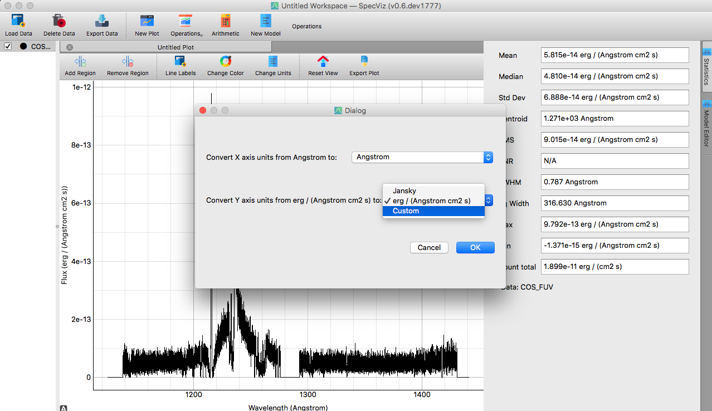
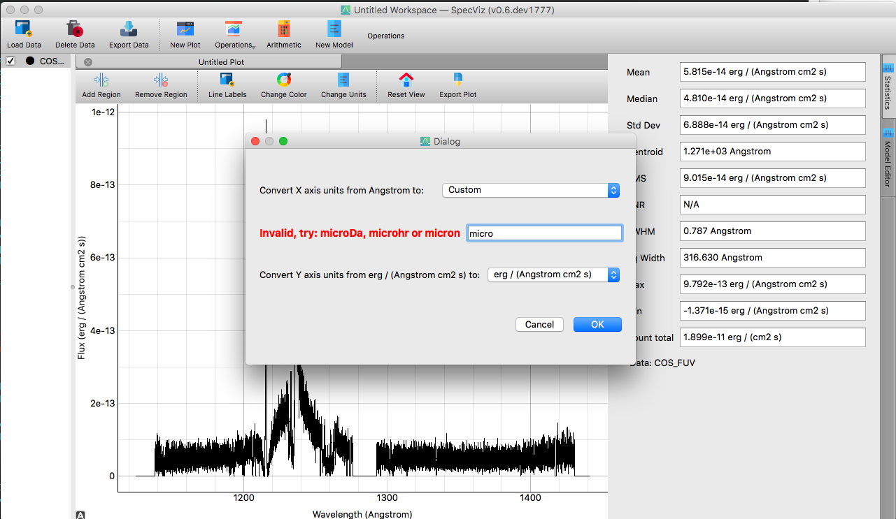
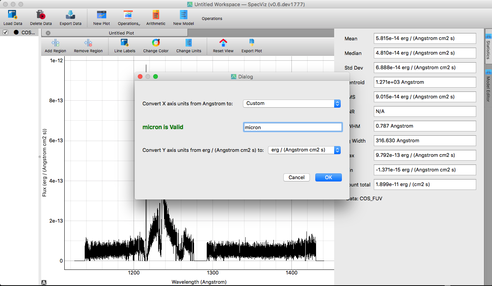

.. _specviz-unit-conversion:

Unit Conversion
===============

How Unit Conversion Works
-------------------------

Unit Conversion uses the `astropy.units <http://docs.astropy.org/en/stable/units/>`_ module in order to convert spectral
axis and flux units.

.. code-block:: python

    import astropy.units as u

    potential_X_axis_units =
    u.Unit(original_spectral_axis_units).find_equivalent_units(equivalencies=u.spectral())

    potential_Y_axis_units = u.Unit(original_flux_units).find_equivalent_units(
    equivalencies=u.spectral_density(spectral_axis_element))

The GUI comboboxes are then populated by potential_X_axis_units and potential_Y_axis_units, respectively.
The user can then select any of those options - as well as a "Custom" option - and the changes
will be reflected in the plot. If the user selects the "Custom" option, they can type in their own units, and
if the units are accepted by `astropy.units <http://docs.astropy.org/en/stable/units/>`_ the unit conversion dialog box
will allow the units to be parsed. However, "Custom" units are checked to see if the conversion is allowed before
any conversion occurs and if False, the units will not be changed.

