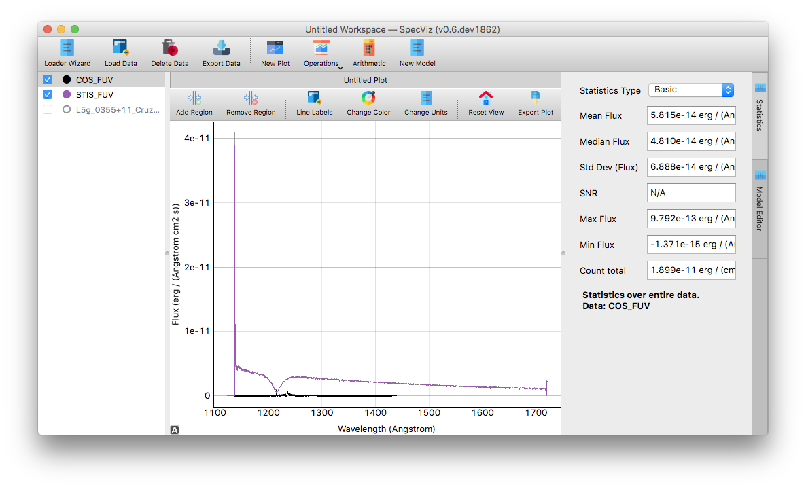

.. DANGER:: 

      Please note that this version of Specviz is **no longer being actively supported
      or maintained**. The functionality of Specviz is now available and being actively
      developed as part of `Jdaviz <https://github.com/spacetelescope/jdaviz>`_.

Workspaces and Plots
=====================

Workspaces
----------

Loaded data is added to the global data list for the entire workspace. A
workspace is an instance of the SpecViz application. Several can be
open at once and more can be added by selecting ``File > New Workspace`` from
the menu bar. Workspaces are completely independent of one another, and the
user can have as many workspaces are they wish.

Each workspace consists of the following components:
    * `Data list`_
    * `Workspace toolbar`_
    * `plugin sidebar`_
    * `Plots`_

.. _specviz-data-list:

Data List
---------
The data list appears on the left of the workspace. This is where all loaded
data/spectra are displayed. The data values of the a given data item are global
to the workspace while the visibility, color and state relate to the currently
displayed `plot <Plots_>`_. To select a specific data simply click on its name.
You can also rename double click on it and typing in the new name; when finished
press enter.

.. _specviz-workspace-toolbar:

Workspace Toolbar
-----------------

.. note::
    When applying an :ref:`operation <specviz_operations>` on a data item (fitting, removing etc.) you must
    first select the data from the data list before clicking the desired toolbar
    button.

This is the main toolbar and appears at the top of each workspace. The tool
bar consists of buttons that control loading/removing data, adding new plots
and buttons that are associated with SpecViz plugins.

.. image:: _static/workspace_toolbar.png

Plugin Sidebar
----------------
The plugin sidebar is where plugin modules such as statistics and model fitting
appear. You can switch between plugins by using the tabs next to the plugin
sidebar.

Plots
-----
Plots are the visual representation of a selection of data items within a
particular workspace. A user can have as many plots as they wish, and new plots
can be created by clicking the ``New Plot`` button in the Workspace toolbar.
Likewise, plot windows can be removed by clicking the ``X`` button in the plot
tab right above the plot window.

Plots all share the same data list within a workspace. The caveat is that plots
can only show data that have equivalent units. Any data that cannot be added
to a plot will show as disabled in the data list.

Clicking the checkbox next to an item in the data list will plot the data
item on the current plot.

.. _specviz-plot-toolbar:

Plot Toolbar
^^^^^^^^^^^^
The plot toolbar contains buttons that relate to the current plot.

.. image:: _static/plot_toolbar.png

The following features are accessible through the plot toolbar:
    * Add or remove :ref:`regions of interest <specviz-regions>`
    * Change the color of the plot
    * :ref:`Unit conversion <specviz-unit-conversion>` of the axes
    * Reset the plot
    * Export the plot to file
